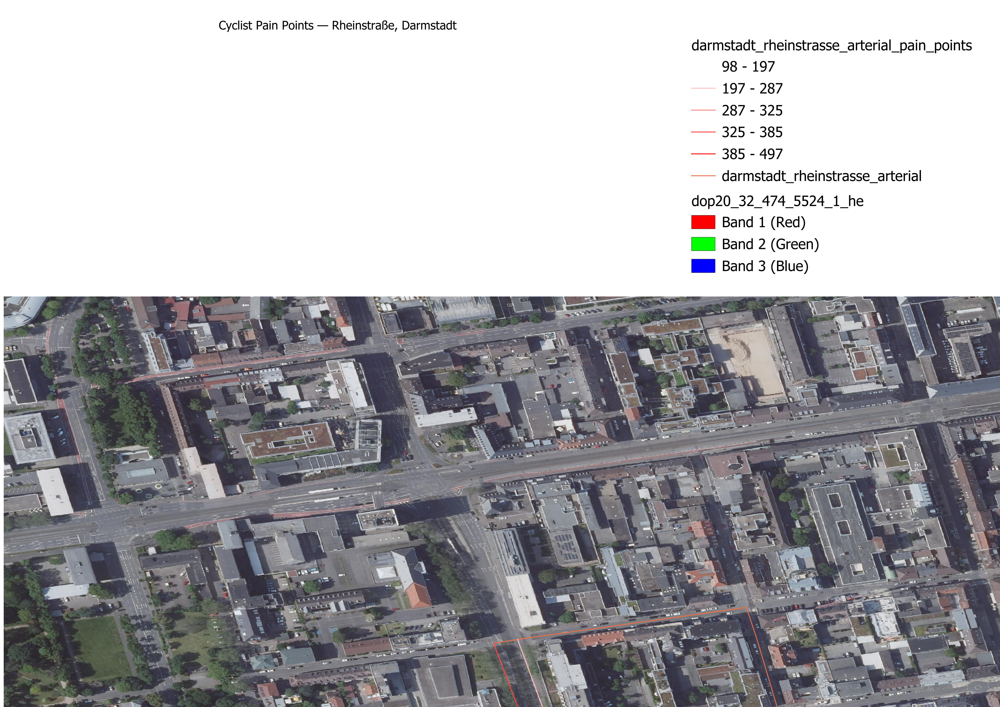

# Cyclist Pain Points

Finding where cyclists are exposed to fast, unprotected traffic — using
OpenStreetMap road-network data only, validated in QGIS.

## Goal

Cities publish road networks, but "which roads are dangerous for cyclists"
isn't a field in OpenStreetMap — it has to be derived. This project answers
one narrow, concrete question for a locked study area:

> **Which road segments carry fast/busy traffic (primary, secondary, or
> tertiary classification) but have no dedicated cycling infrastructure
> (`cycleway` tag missing or `no`) — and which of those are the worst,
> ranked by how much unprotected distance a cyclist has to cover?**

This is deliberately scoped to OSM tags alone — no orthophoto imagery, no
segmentation model, no GPU. The intent is a fast, reproducible, defensible
signal that flags *where to look first*, not a final safety verdict.

## What we found

For the locked study area in central Darmstadt (the Rheinstraße/Hügelstraße
corridor, roughly 350m × 350m), OSMnx pulled a 28-edge drivable road network.
**12 of those 28 edges are unprotected** — primary or secondary roads with no
`cycleway` tag.

Ranking every unprotected edge by `road_class_weight × unprotected_length_m`
(primary weighted 3×, secondary 2×, tertiary 1×) surfaces two streets as the
clear priority:

| Rank | Street | Class | Unprotected length | Pain score |
|---|---|---|---|---|
| 1 | Hügelstraße | primary | 165.7 m | 497.0 |
| 2 | Neckarstraße | primary | 119.0 m | 356.9 |
| 3 | Neckarstraße | primary | 110.7 m | 332.2 |
| 4 | Hügelstraße | primary | 106.6 m | 319.7 |
| 5 | Neckarstraße | secondary | 118.8 m | 237.6 |
| 6 | Neckarstraße | secondary | 111.1 m | 222.2 |
| 7 | Hügelstraße | primary | 32.6 m | 97.7 |

(Each street segment between intersections is a separate edge; some streets
appear more than once because different blocks were tagged or scored
differently. Full ranked list with coordinates:
`data/darmstadt_rheinstrasse_arterial_pain_points.geojson`.)

**Reading it**: Hügelstraße and Neckarstraße are both classified `primary`
in OSM (i.e. carrying through-traffic, not calmed residential streets), run
for well over 100m at a stretch with zero cycling infrastructure, and
together account for the large majority of the total pain-point score in
this study area. If a city were prioritizing where to add a bike lane first
in this specific pocket of Darmstadt, this ranking says: start here.

A second, smaller bbox (near `dop20_32_473_5521_1_he`) was pulled as a
sanity check — it's residential-only by construction, so it correctly
produces zero unprotected edges. That confirms the tagging and scoring logic
isn't just flagging everything; it responds to real road classification.



*QGIS export: full road network (thin gray) and Hügelstraße/Neckarstraße
pain points (graduated red, darker = higher `pain_score`) over a Hessen
DOP20 orthophoto tile.*

## How it works

1. **Lock a study area.** A bbox is fixed once in the notebook config cell
   and kept stable across runs so results are comparable.
2. **Pull the road network from OpenStreetMap** via OSMnx (`network_type="drive"`).
3. **Tag each edge** with its `highway` class and `cycleway` value.
4. **Flag `unprotected`**: `highway` in `{primary, secondary, tertiary}` AND
   `cycleway` is missing or `no`.
5. **Score and rank**: `pain_score = weight[highway] * length_m` for
   unprotected edges only (`primary: 3.0, secondary: 2.0, tertiary: 1.0`).
   Longer unprotected stretches on busier roads score higher. This is a
   simple, transparent proxy — not a calibrated crash-risk probability —
   deliberately kept explainable over "more accurate but opaque."
6. **Export** the full network and the top-N ranked pain points as separate
   GeoJSON/CSV files.
7. **Validate in QGIS**: load both layers plus a DOP20 orthophoto tile,
   style the pain points by `pain_score` on a graduated color ramp, and
   visually confirm the ranking lines up with real, plausible-looking roads
   (not a tagging artifact or a mislabeled service alley).

## Repository layout

```
notebooks/phase2_osm_bbox.ipynb   Full pipeline: fetch, tag, score, rank, export
data/                              GeoJSON + CSV outputs per study area
results/                           Folium HTML preview maps (quick browser check)
qgis/                              QGIS project + exported validation map image
```

## Reproducing this

Requirements: `osmnx`, `geopandas`, `folium`, `pandas` (see notebook imports;
no `requirements.txt` yet since this is a small notebook-first project).

Run `notebooks/phase2_osm_bbox.ipynb` top to bottom. Section 5 runs the
residential sanity-check bbox; Section 5b runs the Rheinstraße bbox used for
the ranking above. Sections 6-8 validate columns, score, rank, and export.

**Overpass reliability note**: the public Overpass API (all mirrors tested —
kumi.systems, overpass-api.de, lz4, z.overpass-api.de) is prone to
congestion and read timeouts, independent of bbox size or query complexity.
If a fetch cell hangs, retry it — that is Overpass being overloaded, not a
bug in this notebook.

To reopen `qgis/cyclist_painpoints.qgz` with the background imagery intact,
the DOP20 orthophoto tile itself is not committed here (large binary, not
our output, not for redistribution). Download the Hessen DOP20 tile
`dop20_32_474_5524_1_he` (`.jpg` + `.jgw` world file) from the Hessen
geodata portal and place it anywhere on disk; QGIS will need the raster
layer re-linked if the path has moved. The project still opens fine with
just the road/pain-point vector layers if you skip this.

## Limitations and next steps

- **OSM tag completeness varies.** A missing `cycleway` tag most often means
  "no cycling infrastructure," but it can occasionally mean "not yet mapped."
  This method inherits whatever gaps exist in OSM for the study area.
- **The scoring weights are a starting point, not a fitted model.** Primary
  = 3×, secondary = 2×, tertiary = 1× is a defensible but arbitrary choice.
  A next iteration could calibrate these against real traffic volume or
  accident data where available.
- **No imagery or segmentation signal yet.** This is intentionally OSM-only.
  A natural extension — not implemented here — is fusing this ranking with
  segmentation output from
  [SegEarth-OV-3](https://github.com/HarishDeepak/rg-segearth-ov3), an
  open-vocabulary remote sensing segmentation project, to check whether the
  ground truth (imagery) agrees with what OSM tags claim.
- **Single study area.** The pipeline generalizes to any bbox; only one has
  been run through the full ranking + QGIS validation so far.
